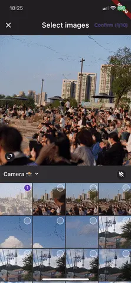

# Instagram Assets Picker

[](https://pub.dev/packages/insta_assets_picker)

> **_NOTE:_** This repository is still in early stage of development. Contributions are welcomed!

An image picker based on Instagram picker UI. It is using the powerful [flutter_wechat_assets_picker](https://pub.dev/packages/wechat_assets_picker)
package to handle the picker and a custom version of [image_crop](https://pub.dev/packages/image_crop) for crop.

## 🚀 Features

- ✅ Instagram layout
    - Scroll behaviors, animation
    - Preview, select, unselect action logic
- ✅ Theme and language customization
- ✅ Multiple images pick (with maximum limit)
- ✅ Restore state of picker after pop
- ✅ Change aspect ratio from 1:1 to 4:5
- ✅ Crop all images at once and receive a stream with a progress value
- ❌ Videos are not supported

## 📸 Screenshots

| Layout and scroll         | Crop                           |
| ------------------------- | ------------------------------ |
|  |  |

## 📖 Installation

Since this package is a custom delegate of [flutter_wechat_assets_picker](https://pub.dev/packages/wechat_assets_picker) you must follow this package setup recommandation : [installation guide](https://pub.dev/packages/wechat_assets_picker#preparing-for-use-).

## 👀 Usage

For more details check out the [example](https://github.com/LeGoffMael/insta_assets_picker/blob/main/example/lib/main.dart).

```dart
Future<void> callPicker() => InstaAssetPicker.pickAssets(
        context,
        title: 'Select images',
        maxAssets: 10,
        onCompleted: (Stream<InstaAssetsExportDetails> stream) {
            // TODO : handle crop stream result
            // i.e : display it using a StreamBuilder
            // - in the same page (closeOnComplete=true)
            // - send it to another page (closeOnComplete=false)
            // or use `stream.listen` to handle the data manually in your state manager
            // - ...
        },
    );
```

Fields in `InstaAssetsExportDetails`:

| Name           | Type                | Description                                             |
| -------------- | ------------------- | ------------------------------------------------------- |
| croppedFiles   | `List<File>`        | List of all cropped files                               |
| selectedAssets | `List<AssetEntity>` | Selected assets without crop                            |
| aspectRatio    | `double`            | Selected aspect ratio (1 or 4/5)                        |
| progress       | `double`            | Progress indicator of the exportation (between 0 and 1) |

Regarding picker configuration : [AssetPickerConfig](https://pub.dev/packages/wechat_assets_picker#usage-)

Regarding `textDelegate` : [Localizations](https://pub.dev/packages/wechat_assets_picker#localizations)

## ✨ Credit

This package is based on [flutter_wechat_assets_picker](https://pub.dev/packages/wechat_assets_picker) by [AlexV525](https://github.com/AlexV525) and [image_crop](https://pub.dev/packages/image_crop) by [lykhonis](https://github.com/lykhonis).